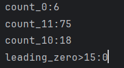

# Gorilla压缩算法
Gorilla压缩算法

什么是IEEE浮点数存储格式

编码

解码

针对时间戳 和浮点数序列的压缩算法

适用于ieee格式浮点数

Segy格式

所以在压缩前需要先判断存储的数据格式 并进行转换

但好在segyio在读取segy格式文件时已经进行了自动转化

存储 

标志位（0:相同 11:不同 10:复用）
前导0数量 4位（0-15）
有效区间长度 5位(0-32)
有效区间 实际长度

为什么理论上的前导0数量为0-32 但是却仅仅存储 4位？ 
压缩前一百位的结果 

 
前两百位的结果 
 
前1000位的结果 
 
对前100000位数据进行运算 
发现需要存储前导0的次数为76032 大于15的前导0的数量为34611 也就是说如果
 
修改后 

修改部分 
扩宽落入区间判定
仅用4位二进制数表示前导0
对10/11状况判定 采取较小的模式存储
